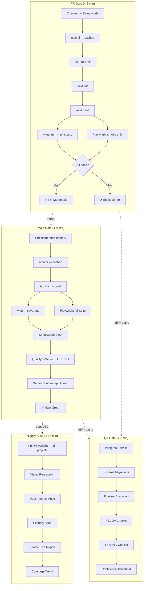

# CI Architecture Audit & Redesign Proposal

> **Status**: PROPOSAL — awaiting approval before implementation
> **Author**: Staff+ DevOps Engineer audit
> **Date**: 2026-02-22
> **Scope**: All `.github/workflows/` files, Sentry integration, performance, enforcement

---

## Table of Contents

1. [Phase 1 — Full CI Audit](#phase-1--full-ci-audit)
2. [Phase 2 — Proposed Elite CI Architecture](#phase-2--proposed-elite-ci-architecture)
3. [Phase 3 — Sentry Integration Plan](#phase-3--sentry-integration-plan)
4. [Phase 4 — Performance & Stability Guards](#phase-4--performance--stability-guards)
5. [Phase 5 — Enforcement Rules](#phase-5--enforcement-rules)

---

## Phase 1 — Full CI Audit

### 1.1 Execution Inventory

| #   | Workflow            | File                | Jobs                    | Trigger                                 |
| --- | ------------------- | ------------------- | ----------------------- | --------------------------------------- |
| 1   | **Build & Test**    | `build.yml`         | 1 (monolith)            | push(main), PR                          |
| 2   | **CI**              | `ci.yml`            | 3 (lint→PW, PW-preview) | push(main), PR                          |
| 3   | **QA Tests**        | `qa.yml`            | 1 (postgres service)    | push(main, path-filtered), PR, dispatch |
| 4   | **Data Audit**      | `data-audit.yml`    | 1                       | schedule 2am UTC, dispatch              |
| 5   | **Deploy Database** | `deploy.yml`        | 2 (preflight→deploy)    | dispatch only                           |
| 6   | **Sync Cloud DB**   | `sync-cloud-db.yml` | 2 (staging→prod)        | push(main, migrations path)             |

### 1.2 Per-Workflow Breakdown

#### `build.yml` — Build & Test (single monolith job)
| Step                  | Command                                                 | Est. Time    |
| --------------------- | ------------------------------------------------------- | ------------ |
| Checkout              | `actions/checkout@v4` (fetch-depth: 0)                  | 5s           |
| Setup Node            | Node 20, npm cache                                      | 10s          |
| Install deps          | `npm ci`                                                | 30-45s       |
| Type-check            | `npm run type-check` → `tsc --noEmit`                   | 15-20s       |
| Lint                  | `npm run lint` → `next lint`                            | 10-15s       |
| Build                 | `npm run build` → `next build`                          | 60-90s       |
| Unit tests + coverage | `vitest run --coverage` (3530 tests)                    | 30-60s       |
| Install Playwright    | `playwright install --with-deps chromium`               | 30-45s       |
| Playwright E2E        | `npx playwright test` **(placeholder keys!)**           | 120-180s     |
| SonarCloud scan       | `sonarqube-scan-action@v6`                              | 30-60s       |
| Quality gate          | `sonarqube-quality-gate-action@v1` (continue-on-error!) | 10-30s       |
| **Total**             |                                                         | **~6-9 min** |

**Issues**: Uses `NEXT_PUBLIC_SUPABASE_URL: http://localhost:54321` / `NEXT_PUBLIC_SUPABASE_ANON_KEY: ci-placeholder-key` for Playwright — no real backend exists, so any test hitting Supabase will fail/skip. This entire Playwright run in build.yml is effectively a smoke test against a dead backend.

#### `ci.yml` — CI (3 jobs)
| Job                                     | Steps                                                                              | Est. Time     |
| --------------------------------------- | ---------------------------------------------------------------------------------- | ------------- |
| **lint-typecheck-build**                | checkout, setup-node, npm ci, tsc, next lint, next build                           | ~3-4 min      |
| **playwright** (needs lint job)         | checkout, setup-node, npm ci, PW install, PW test (real staging keys)              | ~4-6 min      |
| **playwright-preview** (PR only, gated) | checkout, setup-node, npm ci, PW install, wait-for-vercel, PW test --project=smoke | ~5-8 min      |
| **Total (serial)**                      |                                                                                    | **~7-14 min** |

**Issues**: lint-typecheck-build does NOT share its build output with downstream jobs. Playwright job re-installs everything from scratch.

#### `qa.yml` — QA Tests (1 job, postgres service)
| Step                          | Command                                    | Est. Time    |
| ----------------------------- | ------------------------------------------ | ------------ |
| Checkout + Python 3.12 setup  |                                            | 15s          |
| Install Python deps           | `pip install -r requirements.txt`          | 10-15s       |
| Enrichment identity guard     | `python check_enrichment_identity.py`      | 5s           |
| Pipeline structure guard      | `python check_pipeline_structure.py`       | 5s           |
| Apply all schema migrations   | Loop over `supabase/migrations/*.sql`      | 30-60s       |
| Run all category pipelines    | Loop over `db/pipelines/*/PIPELINE__*.sql` | 60-120s      |
| Schema drift detection        | SQL query                                  | 5s           |
| Post-pipeline fixup           | `db/ci_post_pipeline.sql`                  | 5s           |
| QA (421 checks)               | `RUN_QA.ps1`                               | 30-60s       |
| Sanity (17 checks)            | `RUN_SANITY.ps1`                           | 10-20s       |
| Confidence coverage threshold | SQL check                                  | 5s           |
| QA summary + fail gate        |                                            | 5s           |
| **Total**                     |                                            | **~4-7 min** |

**Issues**: Path filter on push only — PR trigger has NO path filter (runs on every PR even for frontend-only changes).

#### `data-audit.yml` — Nightly Data Audit
- **Trigger**: Cron 2am UTC + dispatch
- **Runtime**: ~3-5 min
- **Notes**: Correctly scheduled. Hits live Supabase (prod secrets). Alert webhook on failure. No issues.

#### `deploy.yml` — Deploy Database
- **Trigger**: Manual dispatch with env choice (production/staging) + dry run
- **Runtime**: ~5-10 min
- **Notes**: Well-structured. Has concurrency control. Production requires approval environment. Pre-deploy backup. Post-deploy sanity. **Only workflow with concurrency controls.**

#### `sync-cloud-db.yml` — Sync Cloud DB
- **Trigger**: push(main) with path filter `supabase/migrations/**`
- **Runtime**: ~3-5 min
- **Notes**: Staging→Production chain. Hardcoded production project ref in code (`uskvezwftkkudvksmken`). Should use a secret.

### 1.3 Duplication & Overlap Matrix

```
             build.yml    ci.yml
             ─────────    ──────
Checkout        ✓            ✓ (×3 jobs)
Node setup      ✓            ✓ (×3 jobs)
npm ci          ✓            ✓ (×3 jobs)
Type-check      ✓            ✓
Lint            ✓            ✓
Build           ✓            ✓
PW install      ✓            ✓ (×2 jobs)
PW run          ✓ (dead)     ✓ (real) + ✓ (preview)
```

**Redundant execution on every PR:**
| Operation                       | Times Executed            | Wasted Runs           |
| ------------------------------- | ------------------------- | --------------------- |
| `npm ci`                        | 4× (build + ci×3 jobs)    | 3× wasted             |
| `tsc --noEmit`                  | 2×                        | 1× wasted             |
| `next lint`                     | 2×                        | 1× wasted             |
| `next build`                    | 2×                        | 1× wasted             |
| Playwright install              | 3× (build + ci×2)         | 2× wasted             |
| Playwright E2E                  | 2× (build dead + ci real) | 1× completely useless |
| **Total wasted minutes per PR** |                           | **~8-12 min**         |

### 1.4 Trigger Map

```
Event: pull_request
├── build.yml        ← lint + type-check + build + unit tests + PW (dead) + Sonar
├── ci.yml           ← lint + type-check + build → PW (real) + PW (preview)
└── qa.yml           ← full DB pipeline + 421 QA checks (even for frontend-only PRs!)

Event: push to main
├── build.yml        ← everything again
├── ci.yml           ← everything again
├── qa.yml           ← if db/** or supabase/** changed (path-filtered)
└── sync-cloud-db.yml ← if supabase/migrations/** changed
```

### 1.5 Critical Findings Summary

| #   | Finding                                                                      | Severity     | Impact                                       |
| --- | ---------------------------------------------------------------------------- | ------------ | -------------------------------------------- |
| F1  | `build.yml` and `ci.yml` are ~90% duplicate                                  | **CRITICAL** | 8-12 min wasted per event                    |
| F2  | Playwright in `build.yml` uses placeholder keys — tests against dead backend | **HIGH**     | Useless execution, false confidence          |
| F3  | SonarCloud quality gate has `continue-on-error: true`                        | **HIGH**     | Gate is advisory-only, never blocks merge    |
| F4  | No concurrency controls on `build.yml` or `ci.yml`                           | **MEDIUM**   | Stale runs pile up on rapid pushes           |
| F5  | `qa.yml` PR trigger has no path filter — runs on frontend-only PRs           | **MEDIUM**   | ~4-7 min wasted on irrelevant PRs            |
| F6  | No npm/Playwright browser caching across jobs                                | **MEDIUM**   | ~90s wasted per job on installs              |
| F7  | No `.next` build cache shared between lint→PW jobs                           | **MEDIUM**   | Playwright job cannot reuse build output     |
| F8  | No Sentry sourcemap upload in any CI workflow                                | **HIGH**     | Production errors have minified stack traces |
| F9  | `sentry.client.config.ts` is Turbopack-incompatible                          | **HIGH**     | Will break on Next.js Turbopack migration    |
| F10 | `sync-cloud-db.yml` has hardcoded project ref                                | **LOW**      | Security/maintainability concern             |
| F11 | No test tier separation (smoke vs full vs nightly)                           | **MEDIUM**   | Every event runs max test surface            |
| F12 | `data-audit.yml` is correctly isolated (no issues)                           | OK           | Well-designed nightly workflow               |
| F13 | `deploy.yml` is well-designed (only workflow with concurrency)               | OK           | Good patterns to propagate                   |

---

## Phase 2 — Proposed Elite CI Architecture

### 2.1 Design Principles

1. **Single Responsibility**: One workflow per concern, zero duplication
2. **Tiered Testing**: PR (fast gate) → Main (strict gate) → Nightly (comprehensive)
3. **Fail Fast**: Lint/types first, expensive tests last
4. **Cache Everything**: node_modules, .next, Playwright browsers, pip
5. **Concurrency Control**: Cancel stale runs on rapid pushes
6. **Quality Gates Block Merges**: No more `continue-on-error`

### 2.2 Proposed Workflow Map

| #   | Workflow            | New File                        | Trigger                                                  | Target Runtime |
| --- | ------------------- | ------------------------------- | -------------------------------------------------------- | -------------- |
| 1   | **PR Gate**         | `pr-gate.yml`                   | PR only                                                  | **< 5 min**    |
| 2   | **Main Gate**       | `main-gate.yml`                 | push(main)                                               | **< 8 min**    |
| 3   | **Nightly Suite**   | `nightly.yml`                   | schedule + dispatch                                      | **< 15 min**   |
| 4   | **QA Tests**        | `qa.yml` (refactored)           | push(main, path-filtered) + PR(path-filtered) + dispatch | **< 7 min**    |
| 5   | **Deploy Database** | `deploy.yml` (unchanged)        | dispatch                                                 | **< 10 min**   |
| 6   | **Sync Cloud DB**   | `sync-cloud-db.yml` (minor fix) | push(main, migrations path)                              | **< 5 min**    |

**Deleted**: `build.yml` (absorbed into PR Gate + Main Gate), `ci.yml` (absorbed same)

### 2.3 Architecture Diagram



### 2.4 Detailed Workflow Specifications

#### Workflow 1: `pr-gate.yml` — PR Gate

```yaml
# PROPOSED — DO NOT IMPLEMENT UNTIL APPROVED
name: PR Gate
on:
  pull_request:
    branches: [main]

concurrency:
  group: pr-${{ github.event.pull_request.number }}
  cancel-in-progress: true

jobs:
  gate:
    name: Lint → Type-check → Build → Test
    runs-on: ubuntu-latest
    timeout-minutes: 10
    defaults:
      run:
        working-directory: frontend
    steps:
      - uses: actions/checkout@v4

      - uses: actions/setup-node@v4
        with:
          node-version: 20
          cache: npm
          cache-dependency-path: frontend/package-lock.json

      - run: npm ci

      - name: Type-check
        run: npx tsc --noEmit

      - name: Lint
        run: npx next lint

      - name: Build
        run: npx next build

      - name: Unit tests
        run: npx vitest run

      # Cache build output + PW browsers for E2E job
      - uses: actions/upload-artifact@v4
        with:
          name: build-output
          path: |
            frontend/.next/
            frontend/node_modules/
          retention-days: 1

  e2e-smoke:
    name: Playwright Smoke
    runs-on: ubuntu-latest
    needs: gate
    timeout-minutes: 5
    defaults:
      run:
        working-directory: frontend
    steps:
      - uses: actions/checkout@v4

      - uses: actions/setup-node@v4
        with:
          node-version: 20
          cache: npm
          cache-dependency-path: frontend/package-lock.json

      - run: npm ci

      - name: Cache Playwright browsers
        uses: actions/cache@v4
        with:
          path: ~/.cache/ms-playwright
          key: pw-${{ runner.os }}-${{ hashFiles('frontend/package-lock.json') }}

      - name: Install Playwright browsers
        run: npx playwright install --with-deps chromium

      - name: Run smoke tests only
        run: npx playwright test --project=smoke
        env:
          NEXT_PUBLIC_SUPABASE_URL: ${{ secrets.SUPABASE_URL_STAGING || secrets.NEXT_PUBLIC_SUPABASE_URL }}
          NEXT_PUBLIC_SUPABASE_ANON_KEY: ${{ secrets.SUPABASE_ANON_KEY_STAGING || secrets.NEXT_PUBLIC_SUPABASE_ANON_KEY }}

      - uses: actions/upload-artifact@v4
        if: failure()
        with:
          name: pw-smoke-report
          path: frontend/test-results/
          retention-days: 7
```

**Key changes vs current**:
- Single workflow replaces both `build.yml` + `ci.yml` on PR
- Only smoke Playwright project (not full suite)
- Concurrency: cancels stale runs per PR number
- No SonarCloud scan on PR (scans main only — "Clean as You Code")
- No unit test coverage collection (saves ~10s)

**Estimated runtime**: 3-4 min (gate) + 2-3 min (e2e-smoke parallel) = **~4-5 min total**

#### Workflow 2: `main-gate.yml` — Main Gate

```yaml
# PROPOSED — DO NOT IMPLEMENT UNTIL APPROVED
name: Main Gate
on:
  push:
    branches: [main]

concurrency:
  group: main-gate
  cancel-in-progress: false  # Never cancel main builds

jobs:
  build-test:
    name: Build, Test & Coverage
    runs-on: ubuntu-latest
    timeout-minutes: 12
    defaults:
      run:
        working-directory: frontend
    steps:
      - uses: actions/checkout@v4
        with:
          fetch-depth: 0  # Full history for SonarCloud

      - uses: actions/setup-node@v4
        with:
          node-version: 20
          cache: npm
          cache-dependency-path: frontend/package-lock.json

      - run: npm ci

      - name: Type-check
        run: npx tsc --noEmit

      - name: Lint
        run: npx next lint

      - name: Build
        run: npx next build

      - name: Unit tests with coverage
        run: npx vitest run --coverage

      - name: Cache Playwright browsers
        uses: actions/cache@v4
        with:
          path: ~/.cache/ms-playwright
          key: pw-${{ runner.os }}-${{ hashFiles('frontend/package-lock.json') }}

      - name: Install Playwright browsers
        run: npx playwright install --with-deps chromium

      - name: Playwright full E2E
        run: npx playwright test
        env:
          NEXT_PUBLIC_SUPABASE_URL: ${{ secrets.SUPABASE_URL_STAGING || secrets.NEXT_PUBLIC_SUPABASE_URL }}
          NEXT_PUBLIC_SUPABASE_ANON_KEY: ${{ secrets.SUPABASE_ANON_KEY_STAGING || secrets.NEXT_PUBLIC_SUPABASE_ANON_KEY }}
          SUPABASE_SERVICE_ROLE_KEY: ${{ secrets.SUPABASE_SERVICE_ROLE_KEY_STAGING || secrets.SUPABASE_SERVICE_ROLE_KEY }}

      - uses: actions/upload-artifact@v4
        if: ${{ !cancelled() }}
        with:
          name: playwright-report
          path: |
            frontend/playwright-report/
            frontend/test-results/a11y-results.json
          retention-days: 14

      - name: SonarCloud Scan
        if: env.SONAR_TOKEN != ''
        uses: SonarSource/sonarqube-scan-action@v6
        env:
          SONAR_TOKEN: ${{ secrets.SONAR_TOKEN }}
          SONAR_HOST_URL: https://sonarcloud.io

      - name: SonarCloud Quality Gate
        if: env.SONAR_TOKEN != ''
        uses: SonarSource/sonarqube-quality-gate-action@v1
        # REMOVED continue-on-error — quality gate now BLOCKS
        timeout-minutes: 5
        env:
          SONAR_TOKEN: ${{ secrets.SONAR_TOKEN }}
          SONAR_HOST_URL: https://sonarcloud.io

      - name: Upload Sentry sourcemaps
        if: env.SENTRY_AUTH_TOKEN != ''
        run: npx @sentry/cli sourcemaps upload --org $SENTRY_ORG --project $SENTRY_PROJECT frontend/.next
        env:
          SENTRY_AUTH_TOKEN: ${{ secrets.SENTRY_AUTH_TOKEN }}
          SENTRY_ORG: ${{ secrets.SENTRY_ORG }}
          SENTRY_PROJECT: ${{ secrets.SENTRY_PROJECT }}
```

**Key changes vs current**:
- **Single workflow** replaces both `build.yml` + `ci.yml` on push to main
- **Quality gate is BLOCKING** — no more `continue-on-error`
- **Full Playwright** with real staging keys (not placeholder)
- **Sentry sourcemap upload** after successful build
- **Concurrency**: blocks parallel main builds (never cancel)
- `fetch-depth: 0` for accurate SonarCloud new-code detection

**Estimated runtime**: **~7-8 min**

#### Workflow 3: `nightly.yml` — Nightly Comprehensive Suite

```yaml
# PROPOSED — DO NOT IMPLEMENT UNTIL APPROVED
name: Nightly Suite
on:
  schedule:
    - cron: "0 2 * * *"  # 2am UTC
  workflow_dispatch: {}

jobs:
  comprehensive:
    name: Full Test Suite + Audit
    runs-on: ubuntu-latest
    timeout-minutes: 20
    defaults:
      run:
        working-directory: frontend
    steps:
      - uses: actions/checkout@v4
        with:
          fetch-depth: 0

      - uses: actions/setup-node@v4
        with:
          node-version: 20
          cache: npm
          cache-dependency-path: frontend/package-lock.json

      - run: npm ci

      - name: Build
        run: npx next build

      - name: Unit tests with coverage
        run: npx vitest run --coverage

      - name: Install Playwright browsers
        run: npx playwright install --with-deps chromium

      - name: Full Playwright (all projects including visual)
        run: npx playwright test
        env:
          VISUAL_REGRESSION: "true"
          NEXT_PUBLIC_SUPABASE_URL: ${{ secrets.SUPABASE_URL_STAGING || secrets.NEXT_PUBLIC_SUPABASE_URL }}
          NEXT_PUBLIC_SUPABASE_ANON_KEY: ${{ secrets.SUPABASE_ANON_KEY_STAGING || secrets.NEXT_PUBLIC_SUPABASE_ANON_KEY }}
          SUPABASE_SERVICE_ROLE_KEY: ${{ secrets.SUPABASE_SERVICE_ROLE_KEY_STAGING || secrets.SUPABASE_SERVICE_ROLE_KEY }}

      - uses: actions/upload-artifact@v4
        if: ${{ !cancelled() }}
        with:
          name: nightly-playwright-report
          path: |
            frontend/playwright-report/
            frontend/test-results/
          retention-days: 30

  data-audit:
    name: Data Integrity Audit
    runs-on: ubuntu-latest
    timeout-minutes: 15
    steps:
      - uses: actions/checkout@v4

      - uses: actions/setup-python@v5
        with:
          python-version: "3.12"
          cache: "pip"

      - run: pip install -r requirements.txt

      - name: Run Data Integrity Audit
        env:
          SUPABASE_URL: ${{ secrets.SUPABASE_URL }}
          SUPABASE_SERVICE_KEY: ${{ secrets.SUPABASE_SERVICE_KEY }}
        run: python run_data_audit.py

      - uses: actions/upload-artifact@v4
        if: always()
        with:
          name: data-audit-report
          path: audit-reports/
          retention-days: 90

      - name: Post Summary
        if: always()
        run: |
          REPORT=$(cat audit-reports/audit_*.json 2>/dev/null || echo '{}')
          CRITICAL=$(echo "$REPORT" | python3 -c "import sys,json; print(json.load(sys.stdin).get('summary',{}).get('critical',0))" 2>/dev/null || echo "?")
          WARNINGS=$(echo "$REPORT" | python3 -c "import sys,json; print(json.load(sys.stdin).get('summary',{}).get('warnings',0))" 2>/dev/null || echo "?")
          echo "## Data Integrity Audit" >> $GITHUB_STEP_SUMMARY
          echo "| Severity | Count |" >> $GITHUB_STEP_SUMMARY
          echo "|----------|-------|" >> $GITHUB_STEP_SUMMARY
          echo "| Critical | $CRITICAL |" >> $GITHUB_STEP_SUMMARY
          echo "| Warning | $WARNINGS |" >> $GITHUB_STEP_SUMMARY

      - name: Alert on Critical Findings
        if: failure()
        run: |
          if [ -n "${{ secrets.ALERT_WEBHOOK_URL }}" ]; then
            curl -X POST "${{ secrets.ALERT_WEBHOOK_URL }}" \
              -H 'Content-Type: application/json' \
              -d '{"text": "Nightly audit: CRITICAL issues — https://github.com/${{ github.repository }}/actions/runs/${{ github.run_id }}"}'
          fi
```

**Key changes vs current**:
- **Absorbs `data-audit.yml`** into the nightly workflow (parallel job)
- **Visual regression** tests enabled (`VISUAL_REGRESSION=true`)
- **All Playwright projects** run: smoke + authenticated + visual-smoke + visual-authenticated
- **30-day artifact retention** for nightly reports
- Comprehensive test surface that would be too slow for PR/main gates

**Estimated runtime**: ~12-15 min (both jobs run in parallel)

#### Workflow 4: `qa.yml` — QA Gate (Refactored)

Only change: **Add path filter to PR trigger** to avoid running DB pipeline on frontend-only PRs.

```yaml
on:
  push:
    branches: [main]
    paths:
      - "db/**"
      - "supabase/**"
      # ... existing patterns
  pull_request:
    branches: [main]
    paths:                          # ← NEW: path filter for PRs
      - "db/**"
      - "supabase/**"
      - "pipeline/**"
      - "*.py"
      - "RUN_QA.ps1"
      - "RUN_LOCAL.ps1"
      - "RUN_SEED.ps1"
      - "RUN_SANITY.ps1"
      - ".github/workflows/qa.yml"
  workflow_dispatch:
    inputs:
      fail_on_warn:
        description: "Treat informational warnings as failures"
        required: false
        type: boolean
        default: false
```

Plus add concurrency:
```yaml
concurrency:
  group: qa-${{ github.event.pull_request.number || github.sha }}
  cancel-in-progress: true
```

#### Workflow 5: `deploy.yml` — Unchanged
Already well-designed with concurrency controls, environment gates, and backup/sanity checks.

#### Workflow 6: `sync-cloud-db.yml` — Minor Fix
Replace hardcoded project ref `uskvezwftkkudvksmken` with `${{ secrets.SUPABASE_PROJECT_REF }}`.

### 2.5 Deletion Plan

| File             | Action     | Reason                                        |
| ---------------- | ---------- | --------------------------------------------- |
| `build.yml`      | **DELETE** | Absorbed into `pr-gate.yml` + `main-gate.yml` |
| `ci.yml`         | **DELETE** | Absorbed into `pr-gate.yml` + `main-gate.yml` |
| `data-audit.yml` | **DELETE** | Absorbed into `nightly.yml`                   |

### 2.6 Runtime Comparison

| Event                 | Current                                  | Proposed                                           | Savings                  |
| --------------------- | ---------------------------------------- | -------------------------------------------------- | ------------------------ |
| PR opened/updated     | ~20-25 min (build + ci + qa)             | ~5 min (pr-gate) + 0 min (qa skipped for frontend) | **~15-20 min**           |
| PR with db/** changes | ~20-25 min                               | ~5 min (pr-gate) + ~7 min (qa)                     | **~8-13 min**            |
| Push to main          | ~20-25 min (build + ci + qa conditional) | ~8 min (main-gate) + qa conditional                | **~12-17 min**           |
| Nightly               | ~5 min (data-audit only)                 | ~15 min (comprehensive)                            | N/A (intentionally more) |

---

## Phase 3 — Sentry Integration Plan

### 3.1 Current State

| File                            | Status         | Issue                                                 |
| ------------------------------- | -------------- | ----------------------------------------------------- |
| `sentry.client.config.ts`       | **DEPRECATED** | Turbopack doesn't load this file. Must migrate.       |
| `sentry.server.config.ts`       | OK             | Loaded via `instrumentation.ts`                       |
| `sentry.edge.config.ts`         | OK             | Loaded via `instrumentation.ts`                       |
| `src/instrumentation.ts`        | OK             | Correct Next.js convention for server/edge            |
| `src/instrumentation-client.ts` | **MISSING**    | Required for Turbopack client-side Sentry             |
| `next.config.ts`                | Partial        | `withSentryConfig` present but env vars not set in CI |

### 3.2 Migration Plan

#### Step 1: Create `instrumentation-client.ts`

Create `frontend/src/instrumentation-client.ts` with the contents of `sentry.client.config.ts`. This is the Turbopack-compatible location for client-side instrumentation.

```typescript
// frontend/src/instrumentation-client.ts
// Next.js Turbopack-compatible client instrumentation (#183)
import * as Sentry from "@sentry/nextjs";

Sentry.init({
  dsn: process.env.NEXT_PUBLIC_SENTRY_DSN,
  environment: process.env.NEXT_PUBLIC_VERCEL_ENV ?? "development",
  release: process.env.NEXT_PUBLIC_VERCEL_GIT_COMMIT_SHA,
  enabled: !!process.env.NEXT_PUBLIC_SENTRY_DSN,
  tracesSampleRate: parseFloat(
    process.env.NEXT_PUBLIC_SENTRY_TRACES_SAMPLE_RATE ?? "0.1",
  ),
  replaysSessionSampleRate: 0.0,
  replaysOnErrorSampleRate: 0.0,
  beforeSend(event) {
    if (event.user) {
      delete event.user.email;
      delete event.user.ip_address;
    }
    if (event.breadcrumbs) {
      event.breadcrumbs = event.breadcrumbs.filter(
        (b) =>
          !b.message?.includes("health_profile") &&
          !b.message?.includes("allergen") &&
          !b.message?.includes("health_condition"),
      );
    }
    return event;
  },
  ignoreErrors: [
    "ResizeObserver loop",
    "ResizeObserver loop completed with undelivered notifications",
    "Non-Error promise rejection",
    /Loading chunk \d+ failed/,
    /Failed to fetch dynamically imported module/,
    "AbortError",
  ],
});
```

#### Step 2: Delete `sentry.client.config.ts`

After creating `instrumentation-client.ts`, remove the deprecated file.

#### Step 3: CI Sourcemap Upload (Main Gate Only)

Add to `main-gate.yml` after build:

```yaml
- name: Upload Sentry sourcemaps
  if: env.SENTRY_AUTH_TOKEN != ''
  run: npx @sentry/cli sourcemaps upload --org $SENTRY_ORG --project $SENTRY_PROJECT frontend/.next
  env:
    SENTRY_AUTH_TOKEN: ${{ secrets.SENTRY_AUTH_TOKEN }}
    SENTRY_ORG: ${{ secrets.SENTRY_ORG }}
    SENTRY_PROJECT: ${{ secrets.SENTRY_PROJECT }}
```

**Fork safety**: The `if: env.SENTRY_AUTH_TOKEN != ''` guard ensures forks without the secret skip this step cleanly.

#### Step 4: Required GitHub Secrets

| Secret                   | Purpose                                 | Where Used      |
| ------------------------ | --------------------------------------- | --------------- |
| `SENTRY_AUTH_TOKEN`      | CLI auth for sourcemap upload           | `main-gate.yml` |
| `SENTRY_ORG`             | Sentry org slug                         | `main-gate.yml` |
| `SENTRY_PROJECT`         | Sentry project slug                     | `main-gate.yml` |
| `NEXT_PUBLIC_SENTRY_DSN` | Runtime DSN (already exists for Vercel) | Vercel env only |

### 3.3 `next.config.ts` Changes

The existing `withSentryConfig` wrapper is correct. No changes needed — it already:
- Uploads sourcemaps when `SENTRY_AUTH_TOKEN` is set
- Deletes sourcemaps from build output after upload
- Silences build output in non-CI environments

### 3.4 Sentry Verification Checklist

After implementation:
- [ ] `instrumentation-client.ts` loads in dev with Turbopack (`next dev --turbo`)
- [ ] `sentry.client.config.ts` deleted
- [ ] Sourcemaps appear in Sentry release on main push
- [ ] Errors in production have deobfuscated stack traces
- [ ] Fork PRs don't fail on missing `SENTRY_AUTH_TOKEN`

---

## Phase 4 — Performance & Stability Guards

### 4.1 Caching Strategy

| Cache               | Key                                                                    | Scope                                          | Savings |
| ------------------- | ---------------------------------------------------------------------- | ---------------------------------------------- | ------- |
| npm packages        | `npm-${{ hashFiles('frontend/package-lock.json') }}`                   | Built-in via `actions/setup-node`              | ~30-45s |
| Playwright browsers | `pw-${{ runner.os }}-${{ hashFiles('frontend/package-lock.json') }}`   | `actions/cache@v4` on `~/.cache/ms-playwright` | ~30-45s |
| pip packages        | `pip-${{ hashFiles('requirements.txt') }}`                             | Built-in via `actions/setup-python` cache: pip | ~10-15s |
| `.next` build cache | `next-${{ runner.os }}-${{ hashFiles('frontend/package-lock.json') }}` | `actions/cache@v4` on `frontend/.next/cache`   | ~15-30s |

#### Proposed Cache Implementation

```yaml
# Add to all workflows that run npm ci:
- uses: actions/cache@v4
  with:
    path: frontend/.next/cache
    key: next-cache-${{ runner.os }}-${{ hashFiles('frontend/package-lock.json') }}-${{ hashFiles('frontend/src/**') }}
    restore-keys: |
      next-cache-${{ runner.os }}-${{ hashFiles('frontend/package-lock.json') }}-
      next-cache-${{ runner.os }}-

# Add to all workflows that run Playwright:
- uses: actions/cache@v4
  with:
    path: ~/.cache/ms-playwright
    key: pw-browsers-${{ runner.os }}-${{ hashFiles('frontend/package-lock.json') }}
```

### 4.2 Concurrency Controls

| Workflow            | Group                                                        | Cancel In-Progress                     |
| ------------------- | ------------------------------------------------------------ | -------------------------------------- |
| `pr-gate.yml`       | `pr-${{ github.event.pull_request.number }}`                 | **true** (cancel stale PR runs)        |
| `main-gate.yml`     | `main-gate`                                                  | **false** (never cancel main)          |
| `nightly.yml`       | `nightly`                                                    | **true** (only latest nightly matters) |
| `qa.yml`            | `qa-${{ github.event.pull_request.number \|\| github.sha }}` | **true** for PR, false for main        |
| `deploy.yml`        | `deploy-${{ inputs.environment }}`                           | **false** (already correct)            |
| `sync-cloud-db.yml` | `sync-db`                                                    | **false** (migration order matters)    |

### 4.3 Artifact Retention

| Artifact            | Current | Proposed    | Rationale                             |
| ------------------- | ------- | ----------- | ------------------------------------- |
| PW report (PR)      | 14 days | **7 days**  | Short-lived, PR will be merged/closed |
| PW report (main)    | 14 days | **14 days** | Keep for debugging regressions        |
| PW report (nightly) | N/A     | **30 days** | Trend analysis                        |
| QA results          | 30 days | **30 days** | Unchanged (good)                      |
| Data audit          | 90 days | **90 days** | Unchanged (good, compliance)          |
| Deploy backup       | 30 days | **30 days** | Unchanged (good)                      |

### 4.4 Flake Control

| Measure                 | Detail                                                           |
| ----------------------- | ---------------------------------------------------------------- |
| Playwright retries      | Already `retries: 2` in CI (from `playwright.config.ts`)         |
| Playwright workers      | Already `workers: 1` in CI (serial for stability)                |
| Global timeout          | Already 600s (10 min) — reduce to 300s for smoke                 |
| Per-test timeout        | Already 30s — appropriate                                        |
| Hydration timeout       | Already 10s (`expect.timeout`) — appropriate                     |
| **NEW: Test isolation** | Add `--project=smoke` for PR gate (only fast tests)              |
| **NEW: Flake report**   | Nightly run should track flake rate via `--reporter=json` output |

### 4.5 Timeout Policy

| Workflow           | Job Timeout | Rationale                        |
| ------------------ | ----------- | -------------------------------- |
| PR Gate: gate      | 10 min      | Build + unit tests with margin   |
| PR Gate: e2e-smoke | 5 min       | Smoke tests only                 |
| Main Gate          | 12 min      | Full suite + SonarCloud + Sentry |
| Nightly            | 20 min      | Everything including visual      |
| QA                 | 10 min      | Already correct                  |
| Deploy             | 15 min      | Backup + push + sanity           |

### 4.6 Observability

| Signal                | Implementation                                     |
| --------------------- | -------------------------------------------------- |
| Workflow duration     | GitHub Actions built-in timing                     |
| Failure rate          | GitHub Actions built-in success/failure badges     |
| SonarCloud trends     | SonarCloud dashboard (already configured)          |
| Coverage trend        | SonarCloud coverage gate + `lcov.info` upload      |
| Sentry release health | Sentry dashboard (after sourcemap upload)          |
| **NEW: CI Summary**   | Add `GITHUB_STEP_SUMMARY` to pr-gate and main-gate |

---

## Phase 5 — Enforcement Rules

### 5.1 Branch Protection Rules

| Rule                            | Current      | Proposed                                                                                 |
| ------------------------------- | ------------ | ---------------------------------------------------------------------------------------- |
| Require status checks to pass   | Unknown      | **Required**: `PR Gate / Lint → Type-check → Build → Test`, `PR Gate / Playwright Smoke` |
| Require SonarCloud quality gate | Not enforced | **Required on main**: `Main Gate / SonarCloud Quality Gate`                              |
| Require linear history          | Unknown      | **Recommended**: Squash merge only                                                       |
| Require up-to-date branches     | Unknown      | **Recommended**: Require branch is up-to-date                                            |

### 5.2 Required Status Checks (PR)

These checks MUST pass before merge is allowed:

1. `PR Gate / Lint → Type-check → Build → Test` — core frontend gate
2. `PR Gate / Playwright Smoke` — basic E2E sanity
3. `QA / Pipeline + QA (421 checks) + Sanity (17 checks)` — only when `db/**` or `supabase/**` paths are touched (use path-based required check or use `paths-ignore` + `if` guard)

### 5.3 Non-Negotiable Standards

| Standard                                       | Enforcement                           |
| ---------------------------------------------- | ------------------------------------- |
| No `continue-on-error` on quality gates        | Code review + this doc                |
| No hardcoded secrets or project refs           | SonarCloud security hotspot detection |
| All secrets via `${{ secrets.* }}`             | GitHub secret scanning                |
| Sentry sourcemaps only on main                 | `if: github.ref == 'refs/heads/main'` |
| Fork-safe: all secret-dependent steps guarded  | `if: env.SECRET != ''` pattern        |
| No placeholder/dummy credentials in Playwright | Use staging secrets or skip           |
| Concurrency controls on all workflows          | This doc is the specification         |
| Timeouts on all jobs                           | This doc is the specification         |

### 5.4 npm Script Inventory (Current vs Proposed)

| Script                | Current                                     | CI Usage       | Change Needed                                         |
| --------------------- | ------------------------------------------- | -------------- | ----------------------------------------------------- |
| `dev`                 | `next dev`                                  | PW webServer   | None                                                  |
| `build`               | `next build`                                | All gates      | None                                                  |
| `lint`                | `next lint`                                 | All gates      | None                                                  |
| `type-check`          | `tsc --noEmit`                              | All gates      | None                                                  |
| `test`                | `vitest run`                                | PR gate        | None                                                  |
| `test:coverage`       | `vitest run --coverage`                     | Main gate      | None                                                  |
| `test:e2e`            | `npx playwright test`                       | Main + nightly | None                                                  |
| `test:e2e:scanner`    | `npx playwright test authenticated-scanner` | —              | None                                                  |
| **`test:e2e:smoke`**  | **MISSING**                                 | PR gate        | **ADD**: `npx playwright test --project=smoke`        |
| **`test:e2e:visual`** | **MISSING**                                 | Nightly        | **ADD**: `VISUAL_REGRESSION=true npx playwright test` |

### 5.5 Implementation Checklist

When approved, implement in this order:

- [ ] **Step 1**: Add missing npm scripts (`test:e2e:smoke`, `test:e2e:visual`)
- [ ] **Step 2**: Create `frontend/src/instrumentation-client.ts`
- [ ] **Step 3**: Delete `frontend/sentry.client.config.ts`
- [ ] **Step 4**: Create `pr-gate.yml`
- [ ] **Step 5**: Create `main-gate.yml`
- [ ] **Step 6**: Create `nightly.yml` (absorbing `data-audit.yml`)
- [ ] **Step 7**: Refactor `qa.yml` (add PR path filter + concurrency)
- [ ] **Step 8**: Fix `sync-cloud-db.yml` (hardcoded ref → secret)
- [ ] **Step 9**: Delete `build.yml`
- [ ] **Step 10**: Delete `ci.yml`
- [ ] **Step 11**: Delete `data-audit.yml`
- [ ] **Step 12**: Add GitHub secrets: `SENTRY_AUTH_TOKEN`, `SENTRY_ORG`, `SENTRY_PROJECT`
- [ ] **Step 13**: Update branch protection rules
- [ ] **Step 14**: Verify all status checks pass on test PR
- [ ] **Step 15**: Update `sonar-project.properties` — change `sonar.qualitygate.wait=true`

---

## Summary of Wins

| Metric                              | Before                       | After                              |
| ----------------------------------- | ---------------------------- | ---------------------------------- |
| Workflows fired per PR              | 3 (build + ci + qa)          | 1-2 (pr-gate, qa if db paths)      |
| Duplicate operations per PR         | 8-12 (lint×2, build×2, etc.) | 0                                  |
| PR feedback time                    | ~20-25 min                   | **< 5 min**                        |
| Main gate time                      | ~20-25 min                   | **< 8 min**                        |
| SonarCloud gate                     | Advisory (continue-on-error) | **Blocking**                       |
| Sentry sourcemaps                   | Not uploaded                 | **Uploaded on every main push**    |
| Sentry client config                | Turbopack-incompatible       | **Turbopack-ready**                |
| Concurrency controls                | 1/6 workflows                | **6/6 workflows**                  |
| Nightly coverage                    | Data audit only              | **Full: visual + audit + all E2E** |
| GitHub Actions minutes/month (est.) | ~180 min/PR×N                | **~60 min/PR×N** (~67% reduction)  |
